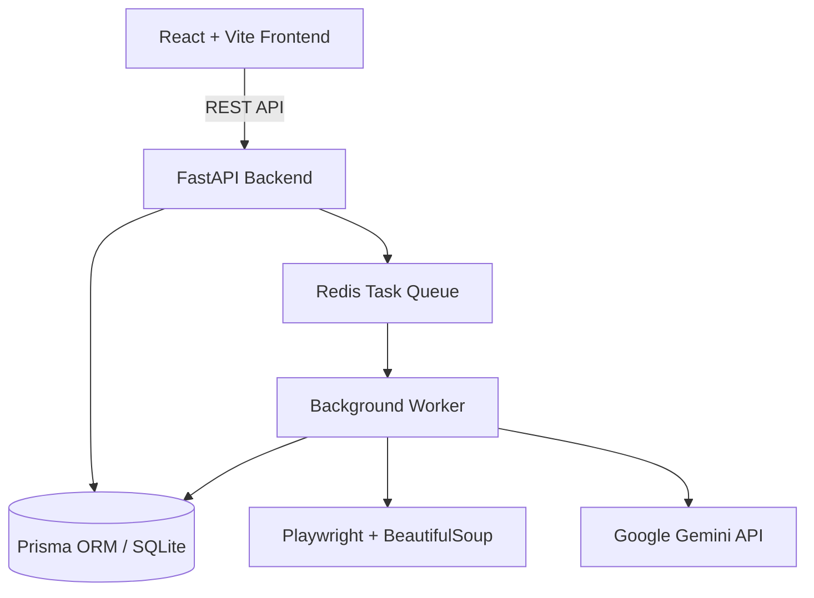

# SEO Intelligence

A self-hosted, open-source technical SEO audit platform, multi-page crawler, and diagnostic suite.

[](LICENSE)
[](https://www.python.org/downloads/)
[](https://fastapi.tiangolo.com)
[](https://react.dev)
[](https://www.docker.com/)

[Overview](#overview) • [Quick Start](#quick-start) • [Local Setup](#local-manual-setup) • [Features](#features) • [API Credentials](#api-credentials) • [Architecture](#architecture) • [License](#license)

---

## Overview

SEO Intelligence is a self-hosted platform for technical SEO analysis, on-page diagnostics, Core Web Vitals checks, and search engine visibility tracking. It runs completely on your own machine or private server without third-party tracking, subscriptions, or paywalls.

Optional third-party services (such as Google Gemini, OpenPageRank, and Keywords Everywhere) can be connected by adding your own API keys.

---

## Quick Start (Docker)

The fastest way to run the entire stack (Backend, Frontend, Redis, Worker) locally:

### 1. Clone the Repository
```bash
git clone https://github.com/noor202401938-netizen/seo-audit-tool.git
cd seo-audit-tool
```

### 2. Configure Environment
```bash
cp .env.example .env
```

### 3. Launch with Docker Compose
```bash
docker compose up --build
```

- **Web Interface**: [http://localhost](http://localhost)
- **API Documentation**: [http://localhost:8000/docs](http://localhost:8000/docs)

To run in the background (detached mode):
```bash
docker compose up -d --build
```
To stop the services:
```bash
docker compose down
```

---

## Local Manual Setup

If you prefer running without Docker, follow these steps:

### Prerequisites
- **Python 3.10+**
- **Node.js 18+** & `npm`

---

### Step 1: Backend Setup

#### On Linux / macOS:
```bash
# 1. Clone and enter directory
git clone https://github.com/noor202401938-netizen/seo-audit-tool.git
cd seo-audit-tool

# 2. Create and activate virtual environment
python3 -m venv venv
source venv/bin/activate

# 3. Install Python dependencies
pip install -r requirements.txt
playwright install chromium

# 4. Copy configuration template
cp .env.example .env

# 5. Generate Prisma client & initialize SQLite database
prisma generate
prisma db push

# 6. Start the API server
uvicorn api:app --reload --port 8000
```

#### On Windows (PowerShell):
```powershell
# 1. Clone and enter directory
git clone https://github.com/noor202401938-netizen/seo-audit-tool.git
cd seo-audit-tool

# 2. Create and activate virtual environment
python -m venv venv
.\venv\Scripts\Activate.ps1

# 3. Install Python dependencies
pip install -r requirements.txt
playwright install chromium

# 4. Copy configuration template
Copy-Item .env.example .env

# 5. Generate Prisma client & initialize SQLite database
prisma generate
prisma db push

# 6. Start the API server
uvicorn api:app --reload --port 8000
```

The backend will be running at [http://localhost:8000](http://localhost:8000).

---

### Step 2: Frontend Setup

Open a new terminal window and run:

```bash
cd seo-audit-tool/frontend

# Install dependencies
npm install

# Start the Vite development server
npm run dev
```

Open [http://localhost:5173](http://localhost:5173) in your browser.

---

### Step 3: Background Worker (Optional)

If you have Redis installed locally (`redis://localhost:6379/0`), you can run background workers in a separate terminal:

```bash
python worker.py
```

*(Note: If Redis is not detected, the backend automatically processes audit jobs synchronously in an in-memory thread pool).*

---

## Features

### Technical & On-Page Audits
- **On-Page Diagnostics**: Evaluates title tags, meta descriptions, canonical URLs, heading hierarchy (H1-H6), content length, readability indices, and image alt attributes.
- **Technical Infrastructure**: Analyzes `robots.txt` directives, XML sitemaps, HTTP status codes, redirect chains (301/302), and security headers.
- **Performance**: Measures Core Web Vitals, page weight, compression efficiency, and DOM complexity.
- **Multi-Page Crawler**: Configurable depth and page limits with Playwright rendering for JavaScript-heavy single-page applications.

### AI Remediation
- **Contextual Fixes**: Uses Google Gemini to turn audit findings into prioritized remediation plans with code snippets.
- **LLM Readiness**: Generates standard `llms.txt` files for AI search indexation.

### Standalone SEO Tools
- **SERP Position Tracking**: Rank checks for Google, YouTube, and Bing.
- **Authority & PageRank**: Domain metrics via OpenPageRank.
- **Keyword Intelligence**: Search volume and CPC analytics.
- **Schema Validation**: Extraction and validation of JSON-LD, Microdata, and OpenGraph metadata.
- **Broken Link Discovery**: Identifies dead internal and external hyperlinks.
- **Archive History**: Snapshot timeline from the Wayback Machine.
- **Technology Profiler**: Detects web servers, frameworks, and CMS platforms.
- **Security Scanner**: Inspects SSL certificates and common header vulnerabilities.

### PDF Export
- Generates downloadable, structured summary reports with score cards and prioritized action lists.

---

## Architecture



- **Frontend**: React 18, TypeScript, Tailwind CSS, Framer Motion, Vite
- **Backend**: FastAPI, Pydantic, Prisma Client Python, JWT Auth
- **Worker**: Redis with RQ (includes automatic in-memory fallback if Redis is not configured)
- **Crawler**: Playwright Chromium, BeautifulSoup4, Lxml, Textstat, ReportLab

---

## API Credentials

Core auditing runs locally with zero external API dependencies. To enable extended live data feeds, add your personal keys in `.env` or via the **Settings** view in the web UI:

| Variable | Service | Use Case | Link |
|---|---|---|---|
| `GEMINI_API_KEY` | Google AI Studio | AI Action Plans & Recommendations | [aistudio.google.com](https://aistudio.google.com/app/apikey) |
| `OPEN_PAGERANK_API_KEY` | OpenPageRank | Domain Authority & PageRank | [domcop.com/openpagerank](https://www.domcop.com/openpagerank/auth/signup) |
| `KEYWORD_EVERYWHERE_API_KEY` | Keywords Everywhere | Search Volume & CPC Metrics | [keywordseverywhere.com](https://keywordseverywhere.com/api.html) |
| `YOUTUBE_API_KEY` | Google Cloud | YouTube Video SERP Tracking | [console.cloud.google.com](https://console.cloud.google.com/) |

---

## Configuration Reference

| Variable | Default | Description |
|---|---|---|
| `JWT_SECRET` | *(Required)* | Secret key for JWT session tokens |
| `DATABASE_URL` | `file:data/seo_auditor.db` | SQLite database file path |
| `REDIS_URL` | `redis://localhost:6379/0` | Redis queue connection URI |
| `FRONTEND_URL` | `http://localhost:5173` | Allowed CORS origin |
| `LOG_LEVEL` | `INFO` | Logging level (DEBUG, INFO, WARNING, ERROR) |

---

## Testing

```bash
# Run backend tests
python -m unittest discover tests

# Validate frontend build
cd frontend
npm run build
```

---

## Adding Custom Tools

To add a new audit tool:

1. Implement the logic in `tool_runners.py`:
   ```python
   def run_custom_check(url: str) -> dict:
       return {"status": "ok", "url": url, "result": "passed"}
   ```
2. Add a route in `routers/tools.py`:
   ```python
   @router.post("/custom-check")
   async def custom_check(req: ToolRequest, user = Depends(get_current_user)):
       return tool_runners.run_custom_check(req.url)
   ```
3. Register the UI card in `frontend/src/pages/ToolRunner.tsx`.

---

## Contributing

See [CONTRIBUTING.md](CONTRIBUTING.md) for contribution guidelines, branch strategies, and coding standards.

---

## Security

See [SECURITY.md](SECURITY.md) for vulnerability reporting and deployment security notes.

---

## Acknowledgements

- Built upon the foundational SEOmator engine and rules from [seo-skills/seo-audit-skill](https://github.com/seo-skills/seo-audit-skill).

---

## License

Distributed under the MIT License. See [LICENSE](LICENSE) for details.
