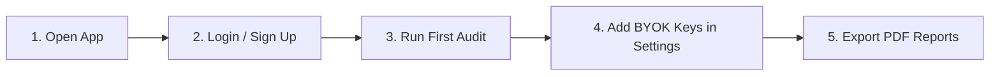

# SEO Intelligence

A self-hosted, open-source technical SEO audit platform, multi-page crawler, and diagnostic suite.

[](LICENSE)
[](https://www.python.org/downloads/)
[](https://fastapi.tiangolo.com)
[](https://react.dev)
[](https://www.docker.com/)

[Overview](#overview) • [1-Click Launchers](#method-1-1-click-launchers-easiest) • [Local Terminal Setup](#method-2-local-terminal-setup-developers) • [Docker Setup](#method-3-docker-desktop-containers) • [First-Time App Usage](#first-time-app-usage-guide) • [API Credentials](#api-credentials-byok) • [Architecture](#architecture) • [License](#license)

---

## Overview

SEO Intelligence is a self-hosted platform for technical SEO analysis, on-page diagnostics, Core Web Vitals checks, and search engine visibility tracking. It runs completely on your own machine or private server without third-party tracking, subscriptions, or paywalls.

Optional third-party services (such as Google Gemini, OpenPageRank, and Keywords Everywhere) can be connected by adding your own API keys in your local settings.

---

## Prerequisites (Check Once Before Starting)

Ensure you have the following installed on your machine:
- **Python 3.10+**: Download from [python.org](https://www.python.org/downloads/) *(Make sure to check "Add Python to PATH" during installation on Windows)*.
- **Node.js 20+ & npm**: Download LTS from [nodejs.org](https://nodejs.org/).
- *(Optional for Docker users)*: **Docker Desktop** from [docker.com](https://www.docker.com/).

---

## Method 1: 1-Click Launchers (Easiest)

Ideal for running on your personal computer without typing manual terminal commands.

### Step 1: Download the Project
- **Option A (Git)**:
  ```bash
  git clone https://github.com/noor202401938-netizen/seo-audit-tool.git
  cd seo-audit-tool
  ```
- **Option B (ZIP)**: Click the green **Code** button on GitHub $\rightarrow$ **Download ZIP**, and extract it anywhere on your computer.

---

### Step 2: Launch the App

#### On Windows:
- **First-Time Setup**: Simply double-click **[`run-windows.bat`](run-windows.bat)**.
  - The script automatically creates the Python virtual environment (`venv`), installs dependencies, downloads Playwright Chromium, pushes the SQLite database schema, installs frontend packages, boots both servers, and **automatically opens http://localhost:5173 in your default browser**.
- **Subsequent Daily Use**: Just double-click **`run-windows.bat`**. Since all packages are already installed, it boots and opens in ~2 seconds.
- **To Stop**: Press any key in the launcher window or close it.

#### On macOS / Linux:
- **First-Time Setup**:
  ```bash
  chmod +x run.sh
  ./run.sh
  ```
  - The script automatically configures the environment, starts the background services, and opens `http://localhost:5173` in your default browser.
- **Subsequent Daily Use**: Run `./run.sh`.
- **To Stop**: Press `Ctrl + C` in the terminal.

---

## Method 2: Local Terminal Setup (Developers)

If you prefer running services in separate terminal windows for development or customization:

### First-Time Setup

#### 1. Backend Setup

**Linux / macOS:**
```bash
# Clone & navigate
git clone https://github.com/noor202401938-netizen/seo-audit-tool.git
cd seo-audit-tool

# Create and activate virtual environment
python3 -m venv venv
source venv/bin/activate

# Install dependencies & Playwright Chromium
pip install -r requirements.txt
playwright install chromium

# Copy config template
cp .env.example .env

# Initialize database schema
prisma generate
prisma db push

# Start API server
uvicorn api:app --reload --port 8000
```

**Windows (PowerShell):**
```powershell
# Clone & navigate
git clone https://github.com/noor202401938-netizen/seo-audit-tool.git
cd seo-audit-tool

# Create and activate virtual environment
python -m venv venv
.\venv\Scripts\Activate.ps1

# Install dependencies & Playwright Chromium
pip install -r requirements.txt
playwright install chromium

# Copy config template
Copy-Item .env.example .env

# Initialize database schema
prisma generate
prisma db push

# Start API server
uvicorn api:app --reload --port 8000
```

#### 2. Frontend Setup (Open a second terminal)
```bash
cd seo-audit-tool/frontend
npm install
npm run dev
```

---

### Subsequent Daily Use (Terminal)

Whenever you want to use the app later:

1. **Terminal 1 (Backend)**:
   ```bash
   # Windows: .\venv\Scripts\Activate.ps1
   # Linux/Mac: source venv/bin/activate
   uvicorn api:app --port 8000
   ```
2. **Terminal 2 (Frontend)**:
   ```bash
   cd frontend
   npm run dev
   ```
3. Open [http://localhost:5173](http://localhost:5173).

---

## Method 3: Docker Desktop / Containers

For servers or containerized local hosting:

### First-Time Setup
```bash
git clone https://github.com/noor202401938-netizen/seo-audit-tool.git
cd seo-audit-tool
cp .env.example .env
docker compose up --build
```
- **Web UI**: [http://localhost](http://localhost)
- **API Docs**: [http://localhost:8000/docs](http://localhost:8000/docs)

### Subsequent Daily Use
- **Start in background**:
  ```bash
  docker compose up -d
  ```
- **Stop**:
  ```bash
  docker compose down
  ```
- *(Windows 1-Click Docker)*: Double-click **[`docker-run.bat`](docker-run.bat)**.

---

## First-Time App Usage Guide

Once the web application is running at `http://localhost:5173` (or `http://localhost` on Docker):



### 1. Account Access & Login
- Click **Launch Local Dashboard** or visit `http://localhost:5173/login`.
- **Demo Account**: Click **"Fill Demo Credentials"** (`demo@seoaudit.com` / `demo123456`) to log in immediately, or create your own local account on `/signup`.

### 2. Running an Audit
1. In the Dashboard (`/app`), enter any target URL (e.g. `https://example.com`).
2. Choose your audit type:
   - **Single Page Audit**: Fast diagnostic of on-page metadata, headings, performance, and Core Web Vitals.
   - **Multi-Page Crawler**: Configurable depth and page limits with headless Playwright JavaScript execution.
3. Click **Start Audit**. View live progress and extraction feed in real time.

### 3. Adding Extended API Keys (Optional)
To enable live AI remediation, search volume, and domain authority:
1. Navigate to **Profile / Settings** (`/app/profile`).
2. Enter your personal API keys (Google Gemini, OpenPageRank, Keywords Everywhere, YouTube).
3. Click **Save Config**. Keys are stored locally on your machine.

### 4. Standalone Tools
Explore 25+ specialized tools from the sidebar:
- Robots.txt & Sitemap Testers
- HTTP Security & SSL Certificate Checkers
- Canonical Tag & Redirect Validators
- Wayback Machine Historical Snapshots
- Competitor Technology & SERP Position Trackers

### 5. Exporting Reports
Click **Download PDF** on any completed audit to generate a branded, multi-page diagnostic summary report.

---

## API Credentials (BYOK)

Core auditing runs locally with zero external API dependencies. To enable extended live data feeds, add your personal keys in `.env` or via **Settings** in the web UI:

| Variable | Service | Use Case | Free Tier Link |
|---|---|---|---|
| `GEMINI_API_KEY` | Google AI Studio | AI Action Plans & Code Fixes | [aistudio.google.com](https://aistudio.google.com/app/apikey) |
| `OPEN_PAGERANK_API_KEY` | OpenPageRank | Domain Authority & PageRank | [domcop.com/openpagerank](https://www.domcop.com/openpagerank/auth/signup) |
| `KEYWORD_EVERYWHERE_API_KEY` | Keywords Everywhere | Search Volume & CPC Metrics | [keywordseverywhere.com](https://keywordseverywhere.com/api.html) |
| `YOUTUBE_API_KEY` | Google Cloud | YouTube Video SERP Tracking | [console.cloud.google.com](https://console.cloud.google.com/) |

---

## Configuration Reference

| Variable | Default | Description |
|---|---|---|
| `JWT_SECRET` | *(Required)* | Secret key for JWT session tokens |
| `DATABASE_URL` | `file:data/seo_auditor.db` | SQLite database file path |
| `REDIS_URL` | `redis://localhost:6379/0` | Redis queue connection URI (falls back to in-memory if absent) |
| `FRONTEND_URL` | `http://localhost:5173` | Allowed CORS origin |
| `LOG_LEVEL` | `INFO` | Logging level (DEBUG, INFO, WARNING, ERROR) |

---

## Testing & Verification

```bash
# Run backend tests
python -m unittest discover tests

# Validate frontend production build
cd frontend
npm run build
```

---

## Acknowledgements

- Built upon the foundational SEOmator engine and rules from [seo-skills/seo-audit-skill](https://github.com/seo-skills/seo-audit-skill).

---

## License

Distributed under the MIT License. See [LICENSE](LICENSE) for details.
